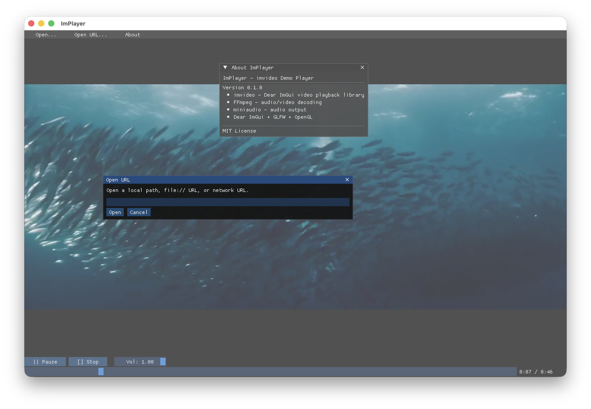

<p align="center">
  <h1 align="center">ImVideo</h1>
</p>

<p align="center">
  <strong>A Dear ImGui video playback extension library with FFmpeg decoding, miniaudio output, and OpenGL texture upload — cross-platform, single header, static linking friendly.</strong>
</p>

<p align="center">
  <a href="docs/README_zh.md">中文说明</a>
</p>

<p align="center">
  <a href="https://en.cppreference.com/w/cpp/20"></a>
  <a href="https://cmake.org/"></a>
  <a href="LICENSE"></a>
</p>

<p align="center">
  
</p>

## Features

- **FFmpeg backend** — demux, decode, and scale via avcodec / avformat / swscale / swresample
- **miniaudio** — low-latency audio output with PCM ring buffer
- **OpenGL texture** — uploads frames directly to an OpenGL texture for ImGui rendering
- **Single header** — `#include <imvideo/imvideo.h>` is all you need
- **Static linking** — vcpkg builds produce self-contained static libraries
- **Cross-platform** — macOS arm64 + Windows x86-64 (MinGW cross-compile)

## Library overview

```cpp
#include <imvideo/imvideo.h>

imvideo::Player player;

// Open from local file path:
if (!player.Open(std::filesystem::path("video.mp4"))) {
    fprintf(stderr, "Error: %s\n", player.LastError());
    return;
}
// Or from a network URL (http/https/rtsp/rtmp):
// player.OpenUrl("http://example.com/stream.m3u8");
// player.Open(std::string_view{"https://example.com/video.mp4"});  // auto-detected
// player.Open(std::string_view{"file:///home/user/video.mp4"});    // auto-detected

player.Play();

// In your render loop (with a current GL context):
player.Update();

// Inside an ImGui window:
imvideo::Video(player);   // full widget: image + timeline + buttons
imvideo::Image(player, ImVec2(640, 360));  // frame only
```

## How to consume (via vcpkg overlay)

This repository does **not** provide a pre-built vcpkg port. Instead, refer to
[`examples/implayer/`](examples/implayer/) which is a complete standalone CMake project
that consumes `imvideo` via a **vcpkg overlay port** — the recommended way to
use local/custom libraries in vcpkg.

Inside `examples/implayer/` you will find a vcpkg overlay port at `overlay/imvideo/`
that points to the local source tree.  To pull from GitHub instead, replace the
portfile's `SOURCE_PATH` with `vcpkg_from_github(touken928/imvideo …)` and
adjust `vcpkg.json` reference accordingly — no other setup is needed.

### Quick demo

```bash
cd examples/implayer
cmake --preset macos
cmake --build --preset macos
./build/macos/ImPlayer /path/to/video.mp4
# or
./build/macos/ImPlayer rtsp://127.0.0.1:8554/imvideo
```

### Local network stream lab

Use `streamlab/Makefile` to expose one local file over temporary `http`,
`https`, `rtsp`, and `rtmp` endpoints for manual testing:

```bash
cd streamlab
make all INPUT=../oceans.mp4
```

See `streamlab/README.md` for per-protocol targets and variables.

## Public API

All symbols in `imvideo` namespace.

### `Player` class

| Method | Description |
|--------|-------------|
| `Open(path)` | Open a local video file. Returns `false` on error. |
| `Open(source)` | Open a local path or URL (auto-detects `file://`, `http://`, `https://`, `rtsp://`, `rtmp://`). |
| `OpenUrl(url)` | Explicitly open a URL; rejects unsupported schemes with a clear error. |
| `Close()` | Close and release all resources. |
| `Play()` | Start or resume playback. |
| `Pause()` | Pause at current position. |
| `Stop()` | Stop and rewind to beginning. |
| `Seek(s)` | Seek to `s` seconds. |
| `Position()` | Current playback position in seconds (wall clock). |
| `Duration()` | Total duration in seconds (0 if unknown). |
| `IsPlaying()` | Whether playback is active. |
| `SetVolume(v)` | Volume 0–1. |
| `SetSpeed(s)` | Speed (≥ 0.0625). Locked to 1.0 when audio is active. |
| `Update()` | **Must be called each frame** with a current GL context. |
| `Texture()` | Current frame as `ImTextureID`. |
| `VideoSize()` | Native video dimensions. |
| `LastError()` | Human-readable error string. |

### Free functions

| Function | Description |
|----------|-------------|
| `Image(player, size)` | Draw the current frame as a static image. |
| `Video(player, size)` | Draw a full video widget (image + controls). |

## Project layout

```
├── CMakeLists.txt              # Library build
├── include/imvideo/imvideo.h   # Public API (single header)
├── src/                        # Library implementation
└── examples/implayer/          # Standalone demo + vcpkg overlay reference
    ├── src/                    # Demo source (main, app)
    ├── overlay/imvideo/        # Local path overlay port
    ├── CMakePresets.json       # macos / macos-release / mingw-static
    └── toolchains/             # Per-platform toolchain + link config
```

## Dependencies

| Package | Role |
|---------|------|
| FFmpeg | Demux + decode (avcodec, avformat, swscale, swresample) |
| Dear ImGui | Public API dependency (`imgui.h`) |
| miniaudio | Audio output (PCM ring buffer → callback) |
| OpenGL | Texture upload (system library) |

*GLFW and ImGui backends are required by the demo only, not by the library.*

## License

Apache-2.0
